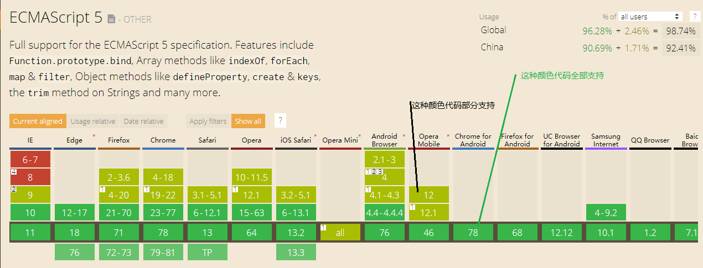
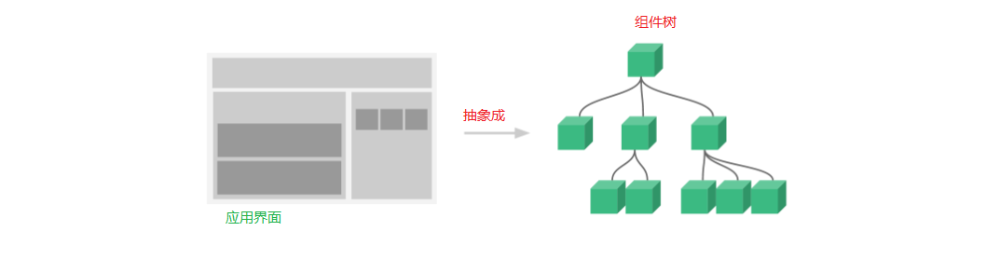

#### 一，安装 npm install vue /脚手架集成

1. Vue **不支持** IE8 及以下版本，

2. 因为 Vue 使用了 IE8 无法模拟的 ECMAScript 5 特性。

3. 但它支持所有[兼容 ECMAScript 5 的浏览器](https://caniuse.com/#feat=es5)。

   

4. 最新稳定版本：2.6.10, 每个版本的更新日志见 [GitHub](https://github.com/vuejs/vue/releases)。
5. vue调试工具 [Vue Devtools](https://cn.vuejs.org/v2/guide/installation.html#Vue-Devtools)

#### 二，vue介绍

1,vue的作用：构建用户界面

2.特点：渐进式框架

3.与其他框架的比较:

​	**a. React 和 Vue 相同点**：

​			**1.使用 Virtual DOM**

​			**2. 提供了响应式 (Reactive) 和组件化 (Composable) 的视图组件。**

​			**3. 将注意力集中保持在核心库，而将其他功能如路由和全局状态管理交给相关的库**

​	**b.vue和react的区别**

​			**b.一. 在 React 应用中，当某个组件的状态发生变化时，它会以该组件为根，重新渲染整个组件子树**。**组件优化伴随着相当的心智负担。**

​				**在 Vue 应用中，组件的依赖是在渲染过程中自动追踪的，所以系统能精确知晓哪个组件确实需要被重渲染**

​			**b.二.在 React 中，一切都是 JavaScript。不仅仅是 HTML 可以用 JSX 来表达，现在的潮流也越来越多地将 CSS 也纳入到 JavaScript 中来处理**（jsx）

​			**在vue中，任何合乎规范的 HTML 都是合法的 Vue 模板**（Templates）

​			**b.三.vue中组件作用域内的 CSS，**

> ```vue
> <style scoped></style> .list-container:hover 编译成 .list-container[data-v-21e5b78]:hover 自动添加了属性 data-v-21e5b78 为组件内 CSS 指定作用域
> ```

​			**react中的组件作用域内的css--样式私有化**   **css module**

​             **在create-react-app中使用css modules的方法：**

​						1.而在css的命名必须为: App.module.css

```vue
import style from './App.module.css';

export default () => {
  return (
    <h1 className={style.title}>
      Hello World
    </h1>
  );
};
```

​			**b.四，状态管理方面，react有flux redux 脚手架用的是react-redux，而vue有vuex**

​			注意：数据绑定到 DOM 文本或特性，还可以绑定到 DOM **结构**。此外，Vue 也提供一个强大的过渡效果系统，可以在 Vue 插入/更新/移除元素时自动应用[过渡效果](https://cn.vuejs.org/v2/guide/transitions.html)。

#### 三，起步

```html
<!-- 开发环境版本，包含了有帮助的命令行警告 -->
 <script src="https://cdn.jsdelivr.net/npm/vue/dist/vue.js"></script>

<!-- 生产环境版本（线上环境），优化了尺寸和速度 -->
<script src="https://cdn.jsdelivr.net/npm/vue"></script>
```

#### 四，vue的特性分析；

1. ​	声明式渲染-----插值表达式-----{{}}---将数据渲染进 DOM 系统的文本。**(双标签中间写{{}})**

   ```vue
   <div id="app">
     {{ message }}
   </div>
   <script>
   var app = new Vue({
     el: '#app',
     data: {
       message: 'Hello Vue!'
     }
   })
   </script>
   ```

2.   将数据渲染进 DOM 系统的特性--v-bind:title="message"

3.  条件与循环**v-if与v-for**

   ```vue
   <p v-if="seen">现在你看到我了</p>
   <div id="app-4">
     <ol>
       <li v-for="todo in todos">
         {{ todo.text }}
       </li>
     </ol>
   </div>
   <script>
   	var app4 = new Vue({
     el: '#app-4',
     data: {
       todos: [
         { text: '学习 JavaScript' },
         { text: '学习 Vue' },
         { text: '整个牛项目' }
       ]
     }
   })
   </script>
   ```

   

4. 事件监听 **v-on**

   ```vue
   <div id="app-5">
     <p>{{ message }}</p>
     <button v-on:click="reverseMessage">反转消息</button>
   </div>
   ```

   

5.组件化构建应用

​	5.1

​	**vue的组件系统**，可以将任意类型的应用界面抽象为一个组件树，允许我们使用**小型**、**独立**和通常**可复用的组件 **     构建    大型应用

​	在 Vue 里，  一个**组件**本质上     是一个    拥有预定义选项的      **一个 Vue 实例**



​		5.2  vue中注册组件。

```vue
<div id="app-7">
  <ol>
    <!--
      现在我们为每个 todo-item 提供 todo 对象
      todo 对象是变量，即其内容可以是动态的。
      我们也需要为每个组件提供一个“key”，稍后再
      作详细解释。
    -->
    <todo-item
      v-for="item in groceryList"
      v-bind:todo="item"
      v-bind:key="item.id"
    ></todo-item>
  </ol>
</div>
<script>
// 全局注册组件    
Vue.component('todo-item', {
  props: ['todo'],
  template: '<li>{{ todo.text }}</li>'
})

var app7 = new Vue({
  el: '#app-7',
  data: {
    groceryList: [
      { id: 0, text: '蔬菜' },
      { id: 1, text: '奶酪' },
      { id: 2, text: '随便其它什么人吃的东西' }
    ]
  }
})
</script>
```


#### 五，vue实例

​	5.1  创建一个vue实例---每个 Vue 应用   都是 通过用      `Vue` 函数     创建一个     新的 **Vue 实例**

```vue
<template>
	<div>
根实例
└─ TodoList
   ├─ TodoItem
   │  ├─ DeleteTodoButton
   │  └─ EditTodoButton
   └─ TodoListFooter
      ├─ ClearTodosButton
      └─ TodoListStatistics
    </div>
</template>
<script>
	var vm = new Vue({
  		// 选项
	})
    // 所有的 Vue 组件都是 Vue 实例
</script>

```

5.2 数据和方法 {data：list：[],methods:...}

​	data:

```vue
<script>
// 我们的数据对象
var data = { a: 1 }
// 该对象被加入到一个 Vue 实例中
var vm = new Vue({
  data: data
})
// 获得这个实例上的属性
// 返回源数据中对应的字段,
// 注意：vue将data和methods方法省略了。
vm.a == data.a // => true
// 设置属性也会影响到原始数据
vm.a = 2
data.a // => 2
// ……反之亦然
data.a = 3
vm.a // => 3
```

```vue
<script>
// 这里唯一的例外是使用 Object.freeze()，这会阻止修改现有的属性，也意味着响应系统无法再追踪变化。
var obj = {
  foo: 'bar'
}

Object.freeze(obj)

new Vue({
  el: '#app',
  data: obj
})
</script>
<div id="app">
  <p>{{ foo }}</p>
  <!-- 这里的 `foo` 不会更新！ -->
  <button v-on:click="foo = 'baz'">Change it</button>
</div>
</script>
```

methods:

```vue
<script>
var data = { a: 1 }
var vm = new Vue({
  el: '#example',
  data: data
})
// dom元素获取。
vm.$data === data // => true
vm.$el === document.getElementById('example') // => true

// $watch 是一个实例方法
vm.$watch('a', function (newValue, oldValue) {
  // 这个回调将在 `vm.a` 改变后调用
})
</script>
```

#### 六，实例之---生命周期钩子

```vue
<script>
new Vue({
  data: {
    a: 1
  },
  created: function () {
    // `this` 指向 vm 实例---下文指向调用它的 Vue 实例
    console.log('a is: ' + this.a)
  }
})
// => "a is: 1"
</script>
```


```vue
<script>
​	// 7.1 常用的生命周期钩子
			初始化阶段
​			1-1 beforeCreate:function(){
​			},
​			1-2 created:function() {
​			},
​			2-1 beforeMount() {
​			},
​			2-2  mounted() {
​			},
    		运行阶段
​			3-1 beforeUpdate(){
​			},
​			3-2 updated () {
​			},
    		销毁阶段
​			4-1 beforeDestroy () {
​			},
​			4-2 destroyed (){
​			},
    		激活和钝化阶段
​			5-1 deactivated：function(){
​			//keep-alive 组件停用,隐藏，时候调用
​			},
​			5-2  activated: function () {
​			// keep-alive 组件激活,显示时候，调用
​			} 
    // 不要在选项属性或回调上使用箭头函数，比如 created: () => console.log(this.a) 或 vm.$watch('a', newValue => this.myMethod())。
    // 因为箭头函数并没有 this，this 会作为变量一直向上级词法作用域查找，直至找到为止，
    // 经常导致 Uncaught TypeError: Cannot read property of undefined 或 Uncaught TypeError: this.myMethod is not a function 之类的错误。
</script>
```

#### 七，生命周期概览图


#### 八，vue的模板语法--HTML模板语法

 1. vue允许开发者，声明式的将DOM绑定到底层vue实例的数据。

 2. vue.js的模板都是合法的HTML,所以vue的模板都能被遵循规范的浏览器和HTML解析器解析。

 3. vue在底层实现上，是将模板编译成虚拟DOM渲染函数，结合响应系统，vue能智能的计算出最少需要重新渲染多少个组件，并且能把DOM的操作次数降低到最少。

 4.  注意： 不使用vue模板，可以直接写渲染函数，使用可选的JSX语法。

    ->vue的模板语法，没有使用vue的渲染函数

```vue
<template>
	<!--需求： 生成一些带锚点的标题-->
	<div>
        <h1>
  			<a name="hello-world" href="#hello-world">Hello world!</a>
		  </h1>
    </div>
	<!--需求： 定义的组件接口-->
	<anchored-heading :level="1">Hello world!</anchored-heading>

</template>
<script type="text/x-template" id="anchored-heading-template">
  <h1 v-if="level === 1">
    <slot></slot>
  </h1>
  <h2 v-else-if="level === 2">
    <slot></slot>
  </h2>
  <h3 v-else-if="level === 3">
    <slot></slot>
  </h3>
  <h4 v-else-if="level === 4">
    <slot></slot>
  </h4>
  <h5 v-else-if="level === 5">
    <slot></slot>
  </h5>
  <h6 v-else-if="level === 6">
    <slot></slot>
  </h6>
</script>
<script>
   // 全局注册组件
	Vue.component('anchored-heading', {
  	template: '#anchored-heading-template',
      props: {level: { type: Number,required: true }
      }
    })
</script>

```

->==vue的渲染函数写法==

```vue
<script>
   // 全局注册组件，上面的模板语法就剔除，需求，接口定义不点
	Vue.component('anchored-heading', {
  		render: function (createElement) {
    		return createElement(
      			'h' + this.level,   // 标签名称
              // $slots.default 是vue的实例属性API
      			this.$slots.default // 子节点数组
    			)
  },
  props: {level: { type: Number,required: true }
  }
})
</script>
```

#### 九，vue数据绑定

1. Mustache语法--（双大括号语法）--文本插值语法-==输出普通的文本==

   ```vue
   <span>Message: {{ msg }}</span>
   <span v-once>这个只执行一次-初始化阶段: {{ msg }}</span>
   <--注意：v-once会影响到该节点上的其他数据绑定-->
   ```

   

2. ==输出原始HTML==--v-html

```vue
<p>Using v-html directive: <span v-html="rawHtml"></span></p>
<--这个 span 的内容将会被替换成为属性值 rawHtml 
      直接作为 HTML,不会解析属性值中的数据绑定
      -->
    <--你不能使用 v-html 来复合局部模板，因为 Vue 不是基于字符串的模板引擎。反之，对于用户界面 (UI)，组件 更适合 作为 可重用和可组合的 基本单位。 -->

```

==请只对可信内容使用    HTML 插值，**绝不要**对用户提供的  内容  使用插值。==--XSS攻击

3. 特性/属性--Mustache 语法不能作用在 HTML 特性上，遇到这种情况应该使用v-bind

```vue
<div v-bind:id="dynamicId"></div>
<-- 布尔特性 -->
<button v-bind:disabled="isButtonDisabled">Button</button>
<-- 如果 isButtonDisabled 的值是 null、undefined 或 false，则 disabled 特性甚至不会被包含在渲染出来的 <button> 元素中。 -->  
```

4. javaScript表达式--【三目运算，加减乘除，字符串的截取split（），翻转reverse（），拼接join（‘’）。。。。】

   ```vue
   <!-- 这是语句，不是表达式 -->
   {{ var a = 1 }}
   
   <!-- 流控制也不会生效，请使用三元表达式 -->
   {{ if (ok) { return message } }}
   <-- 注意：这些表达式 会在 所属 Vue 实例 的数据作用域下 作为 JavaScript 被解析。有个限制就是，每个绑定都只能包含  单个表达式 
       if 语句 变量声明，Math 和 Date 不会生效。
       -->
   ```

   ##### ==模板表达式都被放在沙盒中，只能访问全局变量的一个白名单==，你不应该在模板表

   ##### 达式中试图访问用户定义的全局变量

5. **指令--(Directives) 是带有    `v-` 前缀的   特殊   特性**

   ```vue
   <!--
   指令特性的值预期是单个 JavaScript 表达式 (v-for 是例外情况)。
   指令的职责是，
   当表达式的值改变时，
   将其产生的连带影响，响应式地作用于 DOM
   -->
   <p v-if="seen">现在你看到我了</p>
   <--这里，v-if 指令将根据表达式 seen 的值的真假来插入/移除 <p> 元素。 -->
   
   ```

   ​	5.1 指令-参数

   ​	==一些指令能够接收一个“参数”， 在指令名称 之后    以冒号表示==

   ​	**`		v-bind` 指令可以用于    响应式地   更新 HTML 特性**

   ```vue
   <a v-bind:href="url">...</a>
   <a v-on:click="doSomething">...</a>
   <!-- 
   	click href 是参数，
   	告知 v-bind v-on 指令将该元素的 href click 特性 
   	要与表达式 url doSomething 的值绑定。
   -->
   ```

   ​	5.2 指令--动态参数

   ```vue
   <a v-on:[eventName]="doSomething"> ... </a>
   <--这里的 attributeName 会被作为一个 JavaScript 表达式进行动态求值，求得的值将会作为最终的参数来使用 -->
   ```

   **注意：**

   对动态参数的值的约束--==**动态参数预期会求出一个字符串，异常情况下值为 `null**`==

   对动态参数表达式的约束--<!--不要有 空格和引号-->

   ```vue
   <!-- 这会触发一个编译警告 -->
   <a v-bind:['foo' + bar]="value"> ... </a>
   ```

   **特别注意：**

   避免使用大写字符来命名 ==键名/动太参数==

   <!--
   在 DOM 中使用模板时这段代码会被转换为 `v-bind:[someattr]`。
   除非在实例中有一个名为“someattr”的 property，否则代码不会工作。
   -->
   <a v-bind:[someAttr]="value"> ... </a>	

   ​	5.3 指令-动态修饰符--modifier--以半角句号 `.` 指明的特殊后缀，用于指出一个指令应该以	特殊方式绑定

   ​	**prevent` 修饰符告诉 `v-on` 指令对于触发的事件调用 `event.preventDefault()**

   ```vue
   <form v-on:submit.prevent="onSubmit">...</form>
   ```

   ​	5.4 指令-缩写

   ```vue
   v-bind => :
   <!-- 完整语法 -->
   <a v-bind:href="url">...</a>
   <!-- 缩写 -->
   <a :href="url">...</a>
   
   v-on => @
   <!-- 完整语法 -->
   <a v-on:click="doSomething">...</a>
   <!-- 缩写 -->
   <a @click="doSomething">...</a>
   ```

   
   

#### 十，计算属性和侦听器

​	1. **模板内的表达式非常便利，在模板中放入太多的逻辑会让模板过重且难以维护**

```vue
<div id="example">
  <--变量message的反转字符串，如果多处需要这个反转的字符串？？？？ -->
  {{ message.split('').reverse().join('') }}
  
</div>

```

​	注意：

​	==	对于任何复杂逻辑，你都应当使用**计算属性**==

​	**实例：**

```vue
<template>
<div id="example">
  <p>Original message: "{{ message }}"</p>
  <p>Computed reversed message: "{{ reversedMessage }}"</p>
</div>
</template>
<script>
	var vm = new Vue({
  el: '#example',
  data: {
    message: 'Hello'
  },
  computed: {
    // 计算属性的 getter
    reversedMessage: function () {
      // `this` 指向 vm 实例
      return this.message.split('').reverse().join('')
    }
  }
})
</script>
```

​	**总结：**

​	**声明了一个计算属性 `reversedMessage`，像绑定普通属性一样在模板中绑定计算属性**

​	我们提供的 ==**函数（`reversedMessage`的值）**==

​	**	将用作属性** `vm.reversedMessage` 的 **getter 函数**，而且计算属性的 getter 函数是**没有副作用**

​	`只要，vm.message` 发生改变时，所有依赖 `vm.reversedMessage` 的绑定也会更新。

​	 B，**计算属性缓存和method方法；**

```vue
<template>
	<!--在表达式中 调用方法 来达到  同样的效果 -->
	<p>Reversed message: "{{ reversedMessage() }}"</p>
</template>
<script>
    // 在组件中
methods: {
  reversedMessage: function () {
    return this.message.split('').reverse().join('')
  },
computed: {
  // Date.now() 不是响应式依赖,也不拥有响应式依赖--没有data中的属性值，now不会更新
  now: function () {
    return Date.now()
  }
}
}
</script>
```

​	**总结：**

​	A，B两种方式的最终结果确实是完全相同的。

​	然而，不同的是**计算属性 是基于它们    所拥有的   响应式依赖    进行缓存的**。

​	**如果没有响应式依赖，计算的不是data中的属性，计算属性一次执行，不会更新**

​	只在  相关响应式依赖   发生改变时   它们才会重新求值。

​	这就意味着只要 `message` 还没有发生改变，

​	多次访问 `reversedMessage` 计算属性会立即返回之前的计算结果，

​	**而不必再次/多次 执行函数，触发getter函数**

​	**相比之下，在表达式中 调用method方法，每当触发重新渲染时，调用方法将总会再次执行函数，没有缓存机制**


​	C，**计算属性vs 侦听器**

```vue
<template>
	<div id="demo">{{ fullName }}</div>
</template>
<script>
	var vm = new Vue({
  el: '#demo',
  data: {
    firstName: 'Foo',
    lastName: 'Bar',
    fullName: 'Foo Bar'
  },
  watch: {
    firstName: function (val) {
      this.fullName = val + ' ' + this.lastName
    },
    lastName: function (val) {
      this.fullName = this.firstName + ' ' + val
    }
  }
})

</script>
```

​	**总结：**

​	Vue 提供了一种更通用的方式来观察和响应 Vue 实例上的数据变动：**侦听属性**--**watch**。--慎用。

​	**wath属性是，命令式且重复的，你很容易滥用 ，通常更好的做法是使用计算属性而不是命令式的 `watch` 回调**

```vue
<script>
  computed: {
  	fullName: {
    // getter
    get: function () {
      return this.firstName + ' ' + this.lastName
    },
    // setter
    set: function (newValue) {
      var names = newValue.split(' ')
      this.firstName = names[0]
      this.lastName = names[names.length - 1]
    }
  }
}
</script>

```

​	现在再运行 **`vm.fullName = 'John Doe'` 时**，setter 会被调用，`vm.firstName` 和 `vm.lastName` 也会相应地被更新。

​	D，**自定义 侦听器**--当需要在数据变化时   **执行异步**   或  **开销较大的操作**

```vue
<template>
	<div id="watch-example">
  <p>
    Ask a yes/no question:
    <input v-model="question">
  </p>
  <p>{{ answer }}</p>
</div>
</template>
<!-- 因为 AJAX 库和通用工具的生态已经相当丰富，Vue 核心代码没有重复 -->
<!-- 提供这些功能以保持精简。这也可以让你自由选择自己更熟悉的工具。 -->

<!--引入ajax -->
<script src="https://cdn.jsdelivr.net/npm/axios@0.12.0/dist/axios.min.js"></script>
<!-- 引入 loash 防抖包-->
<script src="https://cdn.jsdelivr.net/npm/lodash@4.13.1/lodash.min.js"></script>
<script>
var watchExampleVM = new Vue({
  el: '#watch-example',
  data: {
    question: '',
    answer: 'I cannot give you an answer until you ask a question!'
  },
  watch: {
    // 如果 `question` 发生改变，这个函数就会运行
    question: function (newQuestion, oldQuestion) {
      this.answer = 'Waiting for you to stop typing...'
      this.debouncedGetAnswer()
    }
  },
  created: function () {
    // `_.debounce` 是一个通过 Lodash 限制操作频率的函数。
    // 在这个例子中，我们希望限制访问 yesno.wtf/api 的频率
    // AJAX 请求直到用户输入完毕才会发出。想要了解更多关于
    // `_.debounce` 函数 (及其近亲 `_.throttle`) 的知识，
    // 请参考：https://lodash.com/docs#debounce
      
    // 1 `_.debounce` 是一个通过 Lodash 限制操作频率的函数
    this.debouncedGetAnswer = _.debounce(this.getAnswer, 500)
  },
  methods: {
    getAnswer: function () {
      // 如果用户没有输入。。。就直接返回。。
      if (this.question.indexOf('?') === -1) {
        this.answer = 'Questions usually contain a question mark. ;-)'
        return
      }
      this.answer = 'Thinking...'
      var vm = this
      axios.get('https://yesno.wtf/api')
        .then(function (response) {
          // 2 将ajax数据放入放到包  _.capitalize（）
          vm.answer = _.capitalize(response.data.answer)
        })
        .catch(function (error) {
          vm.answer = 'Error! Could not reach the API. ' + error
        })
    }
  }
})
</script>
```

#### 十一，Class与Style绑定

​	A.对象语法--绑定data属性

```vue
<template>
	<!--单个类名 -->
	<div v-bind:class="{ active: isActive }"></div>
	<!--多个类名 与普通class属性共存-->
	<div class="static" v-bind:class="{ active: isActive, 'text-danger': hasError }">
    </div>
</template>
<script>
    data: {
  		isActive: true,
  		hasError: false
	}
</script>
```

​	**渲染结果:**

```html
<div class="active"></div>
<div class="static active"></div>
```

​	A. 对象语法--绑定计算属性

```vue
<template>
	<div v-bind:class="classObject"></div>
	<--classObject就是一个对象：	
	{active: this.isActive && !this.error,'text-danger': this.error && this.error.type === 'fatal'} -->
</template>
<script>
   data: {
  	isActive: true,
  	error: null
 	},
	computed: {
  		classObject: function () {
    		return {
      		active: this.isActive && !this.error,
      		'text-danger': this.error && this.error.type === 'fatal'
    	}
  	}
}
</script>
```

​	**注意： 多个单词用 ‘-’连接与 加引号， 'text-danger'**


​	B.数组语法-[]

```vue
<template>
	<!-- 数组-->
	<div v-bind:class="[activeClass, errorClass]"></div>
	<!-- 数组+三元表达式-->
	<div v-bind:class="[isActive ? activeClass : '', errorClass]"></div>
	<!-- 数组+对象语法-->
	<div v-bind:class="[{ active: isActive }, errorClass]"></div>
</template>
<script>
	data: {
  		activeClass: 'active',
  		errorClass: 'text-danger'，
       isActive：true
	}
</script>
```


​	==C.组件绑定Class==

​	**当在一个     自定义组件   上使用 `class` 属性时**，这些 class 将被添加到**该组件的**    **根元素上面**。

​	这个元素上已经存在的 class 不会被覆盖。*


​	**D. 绑定行内样式**

```vue
<template>
	<!--CSS 属性名可以用驼峰式 (camelCase) 或短横线分隔 (kebab-case，记得用引号括起来) 来命名 -->
	<div v-bind:style="{ color: activeColor, fontSize: fontSize + 'px' }"></div>

	<!--直接绑定到一个样式对象通常更好 -->
	<div v-bind:style="styleObject"></div>
	<!-- v-bind:style 的数组语法可以将多个样式对象应用到同一个元素上 -->
	<div v-bind:style="[baseStyles, overridingStyles]"></div>
</template>
<script>
	data: {
        
      activeColor: 'red',
  		fontSize: 30
        
  		styleObject: {
    	color: 'red',
    	fontSize: '13px'
  	}      
}
</script>
```

​	E.自动添加前缀和多重值。

```vue
<!-- 这样写只会渲染数组中最后一个被浏览器支持的值
当 v-bind:style 使用需要添加浏览器引擎前缀的 CSS 属性时，如 transform，Vue.js 会自动侦测并添加相应的前缀。-->
<div :style="{ display: ['-webkit-box', '-ms-flexbox', 'flex'] }"></div>
```

#### 十二，条件渲染

###### 	**1.1 v-if**

```vue
<!-- 因为 v-if 是一个指令，所以必须将它添加到一个元素上。-->
<template>
	<div v-if="type === 'A'">
  		A
	</div>
	<div v-else-if="type === 'B'">
  		B
	</div>
	<div v-else-if="type === 'C'">
 	 	C
	</div>
	<div v-else>
 		 Not A/B/C
	</div>
</template>

<!--如果想切换多个元素呢？此时可以把一个 <template> 元素当做不可见的包裹元素，
并在上面使用 v-if。最终的渲染结果将不包含 <template> 元素。-->
<template v-if="ok">
  <h1>Title</h1>
  <p>Paragraph 1</p>
  <p>Paragraph 2</p>
</template>

```

**注意：**

​	如果想切换多个元素呢？此时可以把一个 <template> 元素当做不可见的包裹元素，
​	并在上面使用 v-if。**最终的渲染结果将不包含 <template> 元素**。

###### 1.2 用 key管理可复用的元素--是否，添加key=“”

```vue
<!-- 没有添加key，vue认为，复用可复用的元素-->
<template v-if="loginType === 'username'">
  <label>Username</label>
  <input placeholder="Enter your username">
</template>
<template v-else>
  <label>Email</label>
  <input placeholder="Enter your email address">
</template>

<!-- 添加了key，vue认为，不可复用的元素-->
<template v-if="loginType === 'username'">
  <label>Username</label>
  <input placeholder="Enter your username" key="username-input">
</template>
<template v-else>
  <label>Email</label>
  <input placeholder="Enter your email address" key="email-input">
</template>

```

**总结： vue默认情况下，是复用可复用DOM元素的。除非添加了唯一key值**

##### 	2.v-show

==**注意，`v-show` 不支持 `<template>元素，也不支持 `v-else**==

##### 	3.v-if    vs    v-show

| 对比清单 |                      v-if                      |             v-show              |
| :------: | :--------------------------------------------: | :-----------------------------: |
| 切换过程 | 条件块内的事件监听器和子组件适当地被销毁和重建 | 并且只是简单地基于 CSS 进行切换 |
|   性能   |                有更高的切换开销                |       更高的初始渲染开销        |
|   场景   |              在运行时条件很少改变              |         非常频繁地切换          |
|  初始化  |                 条件为真才渲染                 | 元素总是会被渲染，不管什么条件  |

##### 	4.v-if 和v-for作用同一元素--不推荐

==**一个元素同时使用** `v-if` 和 `v-for，**v-for 具有比 v-if 更高的优先级**==

```vue
<!--不推荐的方式 -->
<template>
	<ul>
      <li
    	v-for="user in users"
    	v-if="user.isActive"
    	:key="user.id">
    	{{ user.name }}
  		</li>
	</ul>
</template>
<-- 1.推荐的方式：=> computed 计算属性 -->
<template>
    <ul>
  		<li v-for="user in activeUsers" :key="user.id">
    		{{ user.name }}
  		</li>
	</ul>
</template>
<script>
    computed: {
      activeUsers: function () {
        return this.users.filter(function (user) {
      	 	return user.isActive
    	})
  	}
}
</script>
<-- 2.推荐的方式：=> v-if 移动到容器元素 -->
<script>
	<ul v-if="shouldShowUsers">
  		<li v-for="user in users" :key="user.id">
    		{{ user.name }}
  		</li>
	</ul>    
</script>
    

```


#### 十三，列表渲染 

###### 1.0，一个数组对应为一组元素-v-for=> (item, index) in/of items  

```vue
<template>
	<-- 分隔符号：in-->
	<ul id="example-2">
  		<li v-for="(item, index) in items">
    		{{ parentMessage }} - {{ index }} - {{ item.message }}
  		</li>
	</ul>
   <ul id="example-1">
  		<li v-for="item in items">
    		{{ item.message }}
  		</li>
	</ul>
    <-- 分隔符 of-->
    <div v-for="item of items"></div>
    
</template>
<script>
 	/**
 	v-for 指令需要使用 item in items 形式的特殊语法，其中 items 是源数据数组，而 item 则是被迭代的数组元素的  别名。
 	index 是当前的索引
    **/
  var example2 = new Vue({
  el: '#example-2',
  data: {
    parentMessage: 'Parent',
    items: [
      { message: 'Foo' },
      { message: 'Bar' }
    ]
  }
})
</script>
```

tips：**你也可以用 `of` 替代 `in` 作为分隔符，因为它更接近 JavaScript 迭代器的语法**

###### 1.1，v-for使用对象=> value in object

```vue
<template>
	<-- value是 object的value值，不是key，objcet 是目标对象-->
	<ul id="v-for-object" class="demo">
  		<li v-for="value in object">
    		{{ value }}
  		</li>
	</ul>
        
   <!-- 第二个的参数为 property 名称 (也就是键名)-->
   <div v-for="(value, name) in object">
      {{ name }}: {{ value }}
    </div>
   <!-- 
		第三个参数作为索引
		遍历对象时，会按 Object.keys() 的结果遍历，
		但是不能保证它的结果在不同的 JavaScript 引擎下都一致。
	-->
   <div v-for="(value, name, index) in object">
  		{{ index }}. {{ name }}: {{ value }}
	</div>
</template>
<script>
	new Vue({
  		el: '#v-for-object',
  		data: {
    		object: {
      		title: 'How to do lists in Vue',
      		author: 'Jane Doe',
      		publishedAt: '2016-04-10'
   	 	}
  	}
})
</script>
```

###### 1.3 维护状态

```vue
<div v-for="item in items" v-bind:key="item.id">
  <!-- 内容 -->
</div>
```

当 Vue    正在更新使用     v-for     渲染的元素列表时，它默认使用**“就地更新”**的策略。

如果**数据项的顺序被改变**，**Vue 将不会移动 DOM 元素**来匹配数据项的顺序，

而是就地更新每个元素，并且确保它们在每个索引位置正确渲染

这个==**就地更新**==，是高效的，条件是：==**只适用于不依赖子组件状态或临时 DOM 状态 (例如：表单输入值) 的列表渲染输出**==

注意：

**尽可能在使用 `v-for` 时提供 `key` attribute，key不仅是v-for特别关联，还有其他的功能。**

**除非遍历输出的 DOM 内容非常简单，或者是刻意依赖默认行为以获取性能上的提升**

**不要使用对象或数组之类的非基本类型值作为 `v-for` 的 `key`。请用   ==字符串或数值类型的值。==**

###### 1.4 数组更新检测

​	A.变异方法：

​	Vue 将被侦听的  **数组的变异方法**  进行了包裹，，这些  可以触发视图更新    **被包裹过的数组方法**有：

```vue
<script>
	push()
	pop()
	shift()
	unshift()
	splice()
	sort()
	reverse()
</script>
```

B. 替换数组--不会 重新 渲染 整个列表

注意：`filter()`、`concat()` 和 `slice()` 。它们不会改变原始数组，而**总是返回一个新数组**。

```vue
<script>
	example1.items = example1.items.filter(function (item) {
  		return item.message.match(/Foo/)
	})
</script>
```

**总结：**

**Vue 为了使得 DOM 元素得到最大范围的重用**

**而实现了一些智能的启发式方法**，

**所以用一个含有相同元素的数组去替换原来的数组是非常高效的操作**


C, 数组更新检测注意事项--==Vue **不能**检测数组的变动==

1. ==**利用所用给数组添加元素**==

   vm.items[indexOfItem] = newValue

2. ==**修改数组的长度的时候**==

   vm.items.length = newLength

```vue
<script>
	var vm = new Vue({
  			data: {
    		items: ['a', 'b', 'c']
  		}
	})
	vm.items[1] = 'x' // 不是响应性的
	vm.items.length = 2 // 不是响应性的
 	// 解决办法：
   // Vue.set--全局方法
	Vue.set(vm.items, indexOfItem, newValue)
    // vm.$set 实例方法
    vm.$set(vm.items, indexOfItem, newValue)
	// Array.prototype.splice
	 vm.items.splice(indexOfItem, 1, newValue)
    vm.items.splice(newLength)
    
</script>
```

D, 对象变更检测注意事项--**Vue 不能检测对象属性的添加或删除**

```vue
<script>
	var vm = new Vue({
  			data: {
    		a: 1
  		}
	})
	// `vm.a` 现在是响应式的
	vm.b = 2
	// `vm.b` 不是响应式的
</script>
```

1. **对于已经创建的实例**，Vue 不允许**动态添加**==根级别的响应式属性==。但是，可以使用 `Vue.set(object, propertyName, value)` 方法  **向嵌套对象**    **添加响应式属性**

   ```vue
   <script>
   	var vm = new Vue({
     		data: {
       			userProfile: {
         			name: 'Anika'
      	 		}
    		 }
   	})
       
       // 1.全局方法
       Vue.set(vm.userProfile, 'age', 27)
       // 2.实例方法
       vm.$set(vm.userProfile, 'age', 27)
       // 3.添加多个 新的响应式属性--Object.assign() 或 _.extend()
       vm.userProfile = Object.assign({}, vm.userProfile, {
     				age: 27,
     				favoriteColor: 'Vue Green'
   			})
       
   </script>
   ```

   E，显示过滤/排序后的结果

   ```vue
   <template>
   	 <--1 -->
   	 <li v-for="n in evenNumbers">{{ n }}</li>
       <-- 2-->
   	 <li v-for="n in even(numbers)">{{ n }}</li>
   
   </template>
   <script>
       //1. 
       data: {
     	 numbers: [ 1, 2, 3, 4, 5 ]
    },
   computed: {
     evenNumbers: function () {
       return this.numbers.filter(function (number) {
         return number % 2 === 0
       })
     }
   }
   // 2.
   data: {
     numbers: [ 1, 2, 3, 4, 5 ]
   },
   methods: {
     even: function (numbers) {
       return numbers.filter(function (number) {
         return number % 2 === 0
       })
     }
   }
   </script>
   ```

   F，在 `v-for` 里使用的   值范围--**遍历目标的值 范围**

   ```vue
   <template>
   	<div>
     		<span v-for="n in 10">{{ n }} </span>
   	</div>
   	<!-- 1,2,3,4,....10-->
   </template>
   ```

   G，在<template> 上使用 v-for

   ```HTMl
   <ul>
     <template v-for="item in items">
       <li>{{ item.msg }}</li>
       <li class="divider" role="presentation"></li>
     </template>
   </ul>
   ```

   H，v-for 与 v-if 一同使用

   **当它们处于同一节点**，`v-for` 的优先级比 `v-if` 更高，==**这意味着** `v-if` 将分别重复运行于每个 `v-for` 循环中。==

   ```vue
   <template>
   	<-- 当你只想为*部分*项渲染节点时，这种优先级的机制会十分有用-->
   	<li v-for="todo in todos" v-if="!todo.isComplete">
     		{{ todo }}
   	</li>
      <--有条件地跳过循环的执行,=》 解决方案：1. 计算属性，2.v-if至于外曾容器 -->
      <ul v-if="todos.length">
     		<li v-for="todo in todos">
       		{{ todo }}
     		</li>
   	</ul>
   	<p v-else>No todos left!</p>
   </template>
   ```

   J，在组件上使用 **v-for**

   ```vue
   <template>
   	<my-component
     		v-for="(item, index) in items"
     		v-bind:item="item"
     		v-bind:index="index"
     		v-bind:key="item.id">
       </my-component>
   
   </template>
   ```

   **总结： 自定义组件上，使用v-for ,与 像在任何普通元素**一样。

   任何数据都不会被自动传递到组件里，因为组件有自己独立的作用域。

   为了把迭代数据传递到组件里，我们要使用 prop，

   **明确组件数据的来源能够使组件在其他场合重复使用。**

#### 十四，事件处理

 1.==**`v-on` 指令监听 DOM 事件**==，并在触发时运行一些 JavaScript 代码。

```vue
<template>
	<div id="example-1">
       <!--模板中运行的js代码，是简单的js表达式。  v-on 直接接受 js代码 -->
  		<button v-on:click="counter += 1">Add 1</button>
  		<p>The button above has been clicked {{ counter }} times.</p>
	</div>
</template>
<script>
	var example1 = new Vue({
  			el: '#example-1',
  			data: {
    			counter: 0
 		 }
	})
</script>


```

```vue
<template>
	<-- v-on 接收一个 需要调用的  方法名称	-->
   <div id="example-2">
  		<!-- `greet` 是在下面定义的方法名 -->
  		<button v-on:click="greet">Greet</button>
	</div>
   <-- 内联处理器中的方法 -->
   <div id="example-3">
  		<button v-on:click="say('hi')">Say hi</button>
  		<button v-on:click="say('what')">Say what</button>
	</div>
    <-- 内联处理器中的方法,问原始的 DOM 事件==> 特殊变量 $event -->
    <button v-on:click="warn('Form cannot be submitted yet.', $event)">
  			Submit
	</button>
</template>
<script>
	var example2 = new Vue({
  		el: '#example-2',
  		data: {
    		name: 'Vue.js'
  		},
  // 在 `methods` 对象中定义方法
  methods: {
    // 1.
    greet: function (event) {
      // `this` 在方法里指向当前 Vue 实例
      alert('Hello ' + this.name + '!')
      // `event` 是原生 DOM 事件
      if (event) {
        alert(event.target.tagName)
      }
      // 内联处理器中的方法
      say: function (message) {
     		alert(message)
    	}
       // 现在我们可以访问原生事件对象
       warn: function (message, event) {
    		if (event) {
      			event.preventDefault()
    		}
    	alert(message)
  		}
    }
  }
})

</script>
```

2. 事件修饰符

- .stop => event.stopPropagation()

- .prevent => event.preventDefault()

- .capture

- .self

- .once

- .passive

  ```vue
  <templeate>
  <!-- 阻止单击事件继续传播,组织冒泡 -->
  <a v-on:click.stop="doThis"></a>
      
  <!-- 只当在 event.target 是当前元素自身时触发处理函数 没有事件冒泡肯捕获-->
  <!-- 即事件不是从内部元素触发的 -->
  <div v-on:click.self="doThat">...</div>
  <!-- 添加事件监听器时使用事件捕获模式 -->
      
  <!-- 即内部元素触发的事件先在此处理，然后才交由内部元素进行处理 -->
  <-- 其实，就是事件捕获。。。-->  
  <div v-on:click.capture="doThis">...</div>
      
      
  <!-- 提交事件不再重载页面，阻止默认行为 -->
  <form v-on:submit.prevent="onSubmit"></form>
  
  <!-- 修饰符可以串联， -->
  <a v-on:click.stop.prevent="doThat"></a>
  
  <!-- 只有修饰符 -->
  <form v-on:submit.prevent></form>
      
  <!-- 点击事件将只会触发一次 .once 修饰符还能被用到自定义的组件事件上-->
  <a v-on:click.once="doThis"></a>
  <--Vue 还对应 addEventListener 中的 passive 选项提供了 .passive 修饰符。滚动事件的默认行为 (即滚动行为) 将会立即触发 而不会等待 `onScroll` 完成 这其中包含 `event.preventDefault()` 的情况-->
  <div v-on:scroll.passive="onScroll">...</div>
  </templeate>
  ```

  注意：

   ==**`v-on:click.prevent.self` 会阻止所有的点击，而 `v-on:click.self.prevent` 只会阻止对元素自身的点击。**==

  **这个 `.passive` 修饰符尤其能够提升移动端的性能**=> `passive` 会告诉浏览器   你*不*想阻止事件的默认行为。

  ==不要把 `.passive` 和 `.prevent` 一起使用==

  3. 按键修饰符

     - `.enter`
     - `.tab`
     - `.delete` (捕获“删除”和“退格”键)
     - `.esc`
     - `.space`
     - `.up`
     - `.down`
     - `.left`
     - `.right`

     ```vue
     <!-- 只有在 `key` 是 `Enter` 时调用 `vm.submit()` -->
     <input v-on:keyup.enter="submit"> 或者 <input v-on:keyup.13="submit">
     <-- 处理函数只会在 $event.key 等于 PageDown 时被调用。-->
     <input v-on:keyup.page-down="onPageDown">
     <script>
     	// 自定义按键修饰符别名===》可以使用 `v-on:keyup.f1`
     	Vue.config.keyCodes.f1 = 112    
     </script>
     
     ```

   4. 系统修饰键

      - `.ctrl`

      - `.alt`

      - `.shift`

      - `.meta`

        ```vue
        <!-- Alt + C -->
        <input @keyup.alt.67="clear">
        
        <!-- Ctrl + Click -->
        <div @click.ctrl="doSomething">Do something</div>
        
        <!-- 请注意修饰键与常规按键不同，在和 keyup 事件一起用时，事件触发时修饰键必须处于按下状态。换句话说，只有在按住 ctrl 的情况下释放其它按键，才能触发 keyup.ctrl。而单单释放 ctrl 也不会触发事件。如果你想要这样的行为，请为 ctrl 换用 keyCode：keyup.17。-->
        ```

        ```text
        5---.exact 修饰符允许你控制由精确的系统修饰符组合触发的事件。
        ```

        

        ```vue
        <!-- 即使 Alt 或 Shift 被一同按下时也会触发 -->
        <button @click.ctrl="onClick">A</button>
        
        <!-- 有且只有 Ctrl 被按下的时候才触发 -->
        <button @click.ctrl.exact="onCtrlClick">A</button>
        
        <!-- 没有任何系统修饰符被按下的时候才触发 -->
        <button @click.exact="onClick">A</button>
        ```

        **6.鼠标按钮修饰符**

        - `.left`
        - `.right`
        - `.middle`

        灵魂拷问？？？

        ==vue为啥要在为什么在 HTML 中监听事件==

        这种事件监听的方式违背了关注点分离 (separation of concern) 这个长期以来的优良传统。但不必担心，因为所有的 Vue.js 事件处理方法和表达式都严格绑定在当前视图的 ViewModel 上，它不会导致任何维护上的困难

        v-on的好处有哪些？？？

        1. 扫一眼 **HTML 模板**便能轻松定位在 JavaScript 代码里对应的**方法**。
        2. 因为你无须在 JavaScript 里手动绑定事件，你的 **ViewModel 代码可以是非常纯粹的逻辑，和 DOM 完全解耦，更易于测试。**
        3. 当一个 ViewModel 被销毁时，**所有的事件处理器都会自动被删除**。你无须担心如何清理它们。

#### 十五，表单输入绑定=> v-model

###### 一，基础用法

1. *v-model 双向数据绑定的=>表单元素有*： 

   ==A. <input />==

   ==B.<textarea></textarea>==

   ==C.<select></select>==

2. **注意事项：**

   A.**元素**上创建**双向数据绑定**。它会根据  **控件类型**  自动选取正确的方法来   **更新元素**

   B.**v-model 本质**上不过是**语法糖**,它负责**监听**用户的**输入事件**以**更新数据**，**并对一些极端场景**进行一些**特殊处理。**

   C. `v-model` 会将**Vue 实例的数据**作为**数据来源**，而**忽略所有表单元素**的 ==value`、`checked`、`selected`==特性的初始值,因此在**`data` 选项**中声明**表单元素的初始值**。

**3. `v-model` 在内部为不同的输入元素使用不同的属性并抛出不同的事件：**

```html
A=> text 和 textarea 元素使用 value 属性和 input 事件；
B=> checkbox 和 radio 使用 checked 属性和 change 事件；
C=> select 字段将 value 作为 prop 并将 change 作为事件。
```

4. **对于需要使用[输入法](https://zh.wikipedia.org/wiki/输入法) (如中文、日文、韩文等) 的语言，你会发现 `v-model` 不会在输入法组合文字过程中得到更新。如果你也想处理这个过程，请使用 `input` 事件。**

###### 二，应用实例

```vue
<!-- 1.文本和多行文本=> input textarea  -->
<input v-model="message" placeholder="edit me">
<textarea v-model="message" placeholder="add multiple lines"></textarea>
<!--注意： -->
<-- 在文本区域插值 (<textarea>{{text}}</textarea>) 并不会生效，应用 v-model 来代替。-->

<!--2.单个复选框 inpu没有value值-->
<input type="checkbox" id="checkbox" v-model="checked">
<label for="checkbox">{{ checked }}</label>

<!--3.单个复选框 input 有value值-->
<div id='example-3'>
  <input type="checkbox" id="jack" value="Jack" v-model="checkedNames">
  <label for="jack">Jack</label>
  <input type="checkbox" id="john" value="John" v-model="checkedNames">
  <label for="john">John</label>
  <input type="checkbox" id="mike" value="Mike" v-model="checkedNames">
  <label for="mike">Mike</label>
  <br>
  <span>Checked names: {{ checkedNames }}</span>
  <-- 全部选中 输出： Checked names: [ "John", "Jack", "Mike" ]-->
  <!--4.单选按钮： input 有value值，绑定data中的同一个响应式据 type="radio" -->    
  	<div id="example-4">
  	<input type="radio" id="one" value="One" v-model="picked">
  	<label for="one">One</label>
  	<br>
  	<input type="radio" id="two" value="Two" v-model="picked">
  	<label for="two">Two</label>
  	<br>
  	<span>Picked: {{ picked }}</span>
   <!--5.单选选择框 v-model="selected" 绑定的不是数组。。。而是字符串-->
   <div id="example-5">
  		<select v-model="oselected">
    		<option disabled value="">请选择</option>
    		<option>A</option>
    		<option>B</option>
    		<option>C</option>
  		</select>
  		<span>Selected: {{ oselected }}</span>
	</div>
   <-- 注意 如果 v-model 表达式的初始值未能匹配任何选项 disabled value="" oselected的值也是""，
     <select> 元素将被渲染为“未选中”状态。在 iOS 中，这会使用户无法选择第一个选项。因为这样的情况下,iOS 不会触发 change 事件。
      因此，更推荐像上面这样提供一个值为空的禁用选项。
    -->
   <!-- 6.多选选择框 (绑定到一个数组)-->
   <div id="example-6">
  		<select v-model="selected" multiple style="width: 50px;">
    		<option>A</option>
    		<option>B</option>
    		<option>C</option>
  		</select>
  		<br>
  		<span>Selected: {{ selected }}</span>
       <!-- 最后输出：Selected: [ "A", "B" ]-->
	</div>
   <!--7.复选框 true-value false-value -->
   <input
  		type="checkbox"
  		v-model="toggle"
  		true-value="yes"
  		false-value="no"
		>    
   <!-- 8.单选按钮，绑定的v-model的值，是input的value值-->
   <input type="radio" v-model="pick" v-bind:value="a">
   <-- 当选中时 vm.pick === vm.a-->
   <!-- 9.选择框的选项 option的值是一个对象-->
	<select v-model="selected">
    	<!-- 内联对象字面量 -->
  		<option v-bind:value="{ number: 123 }">123</option>
	</select>
   <-- 
       当选中时 typeof vm.selected // => 'object' 
      vm.selected.number // => 123
   -->
</div>    
</div>
<script>
	new Vue({
  		el: '#example-3',
  			data: {
          checkedNames: []，
          oselected: ''，
          selected: []
  		}
	})
    // 当选中时
		vm.toggle === 'yes'
    // 当没有选中时
		vm.toggle === 'no'
  // 这里的 true-value 和 false-value 特性并不会影响输入控件的 value 特性，因为浏览器在提交表单时并不会	// 包含未被选中的复选框。如果要确保表单中这两个值中的一个能够被提交，(比如“yes”或“no”)，请换用单选按钮。
</script>
```

###### 三，表单修饰符

```vue
<template>
	<!--1. .lazy修饰符 在“change”时而非“input”时更新 -->
	<input v-model.lazy="msg" >
	<!--2. .number修饰符 输入值转为数值类型-->
	<input v-model.number="age" type="number">
	<!--3. .number修饰符 动过滤用户输入的首尾空白字符-->
	<input v-model.trim="msg">
</template>
```

#### 十六，组件基础 

###### 	1.基本实例

#### 十七，深入了解组件


